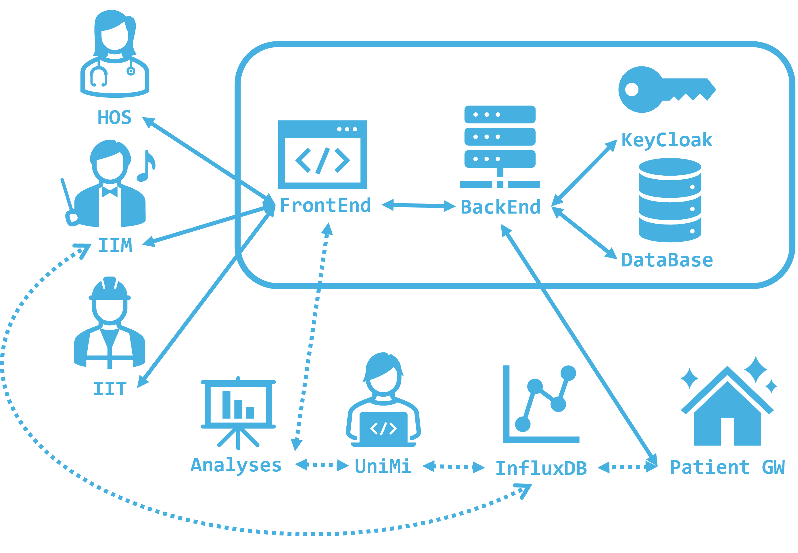
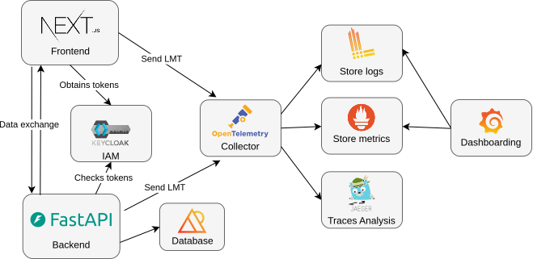
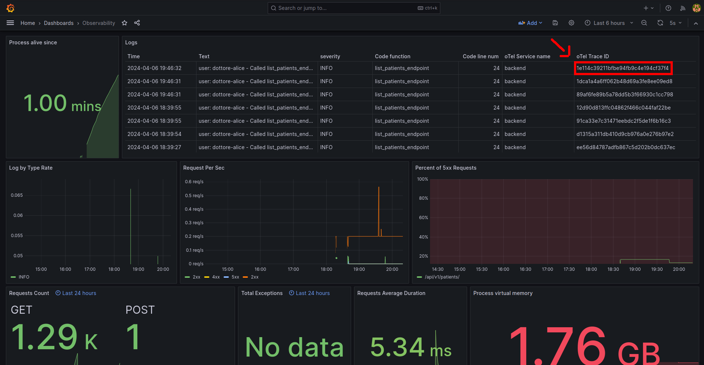
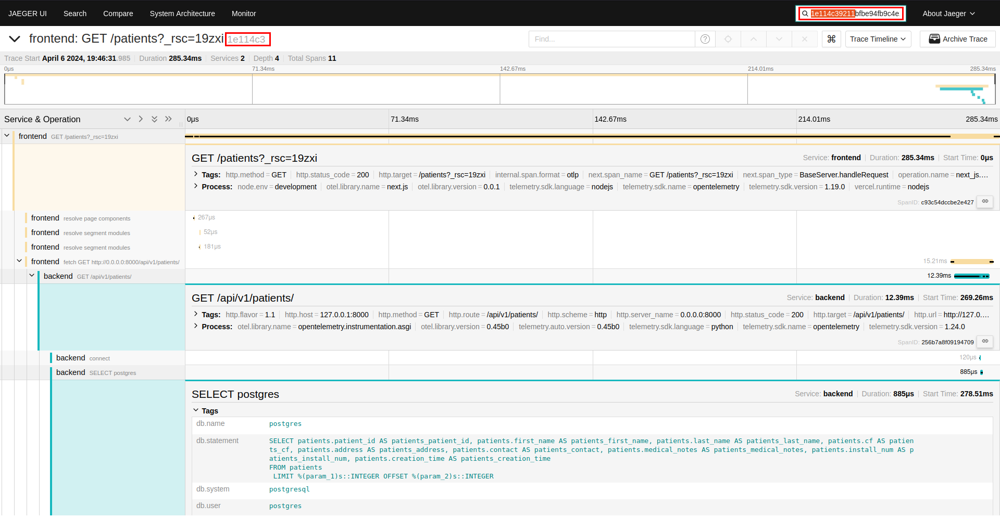
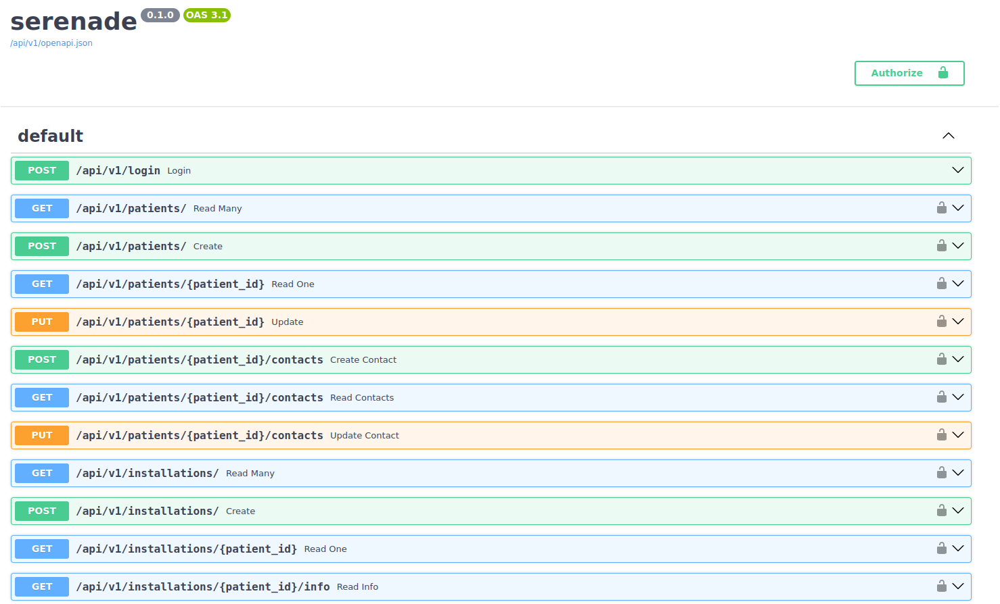
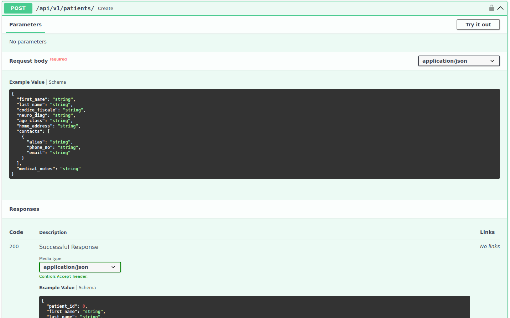
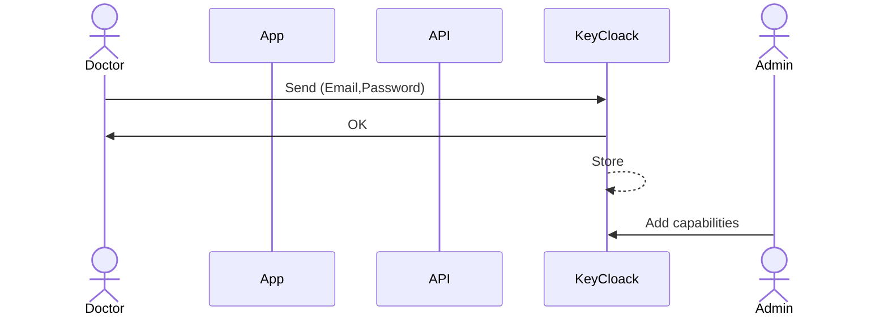
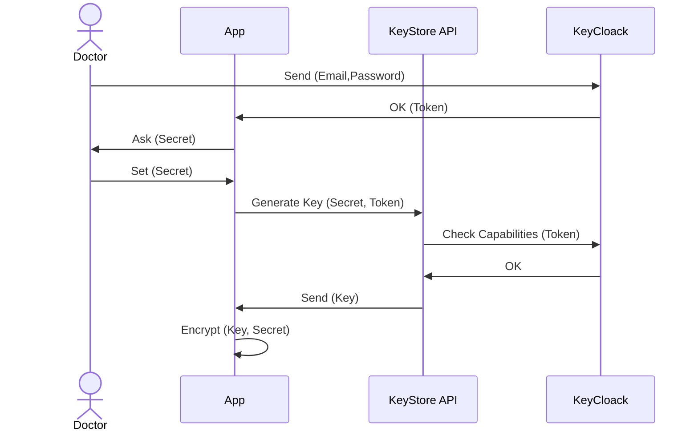
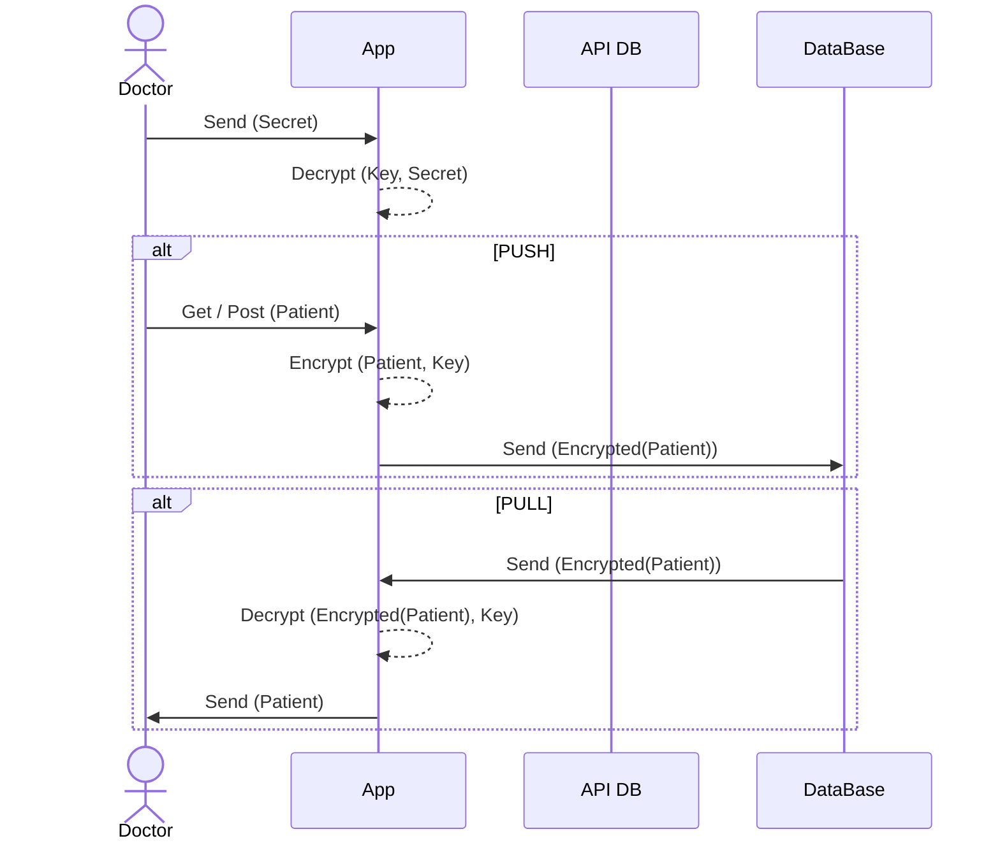

# 🎻 serenade
THE PROJECT IS WIP.

How to spin up the project:
1. clone the repo and checkout the branch `feat-portability`
2. in the source folder `docker compose up`
3. mount the hostnames in your `/etc/hosts` file to use the traefik redirection:
    ```
    127.0.0.1 frontend
    127.0.0.1 keycloak
    127.0.0.1 backend
    ```
4. Access the components at `http://component_name` ex: `http://frontend`
5. Login as users:
   ```
   IIT
   username: iit-gennaro
   pswd: gennaro

   HOS
   username: dottore-alice
   pswd: alice
   ```

## Project Overview
This project is a Pilot study for developing a platform to support the Serenade medical study by Policlinico di Milano in collaboration with Universita' degli studi di Milano. The platform is needed to facilitate the intercollaboration between the Hospital personnel, the hardware installators and the University team of researchers overseeing the study. 

Considering the GDPR's classification of medical data as Special Category Data, the platform ensures precise management and monitoring of data accesses. To achieve correct data access governance the platform follows RBAC (Role-Based Access Control) authorization using the OpenID Connect standard; the access are monitored and store using a modern observability stack.

### Platform Actors
The actors interacting with the system are: hospital personnell (HOS) inputting data about patients, IIM and IIT which are installation teams for the needed hardware in the patients home and the are the researchers overseeing the study (UniMi). 



### System Architecture




## Observability

### Tools
 OpenTelemetry |
 Jaeger | 
 Loki |
 Grafana |

The objective is to observe and store accesses by users to portions of the data. Logs, metrics and traces are employed with this aim.

Grafana can give general observability over the health of the platform using the Prometheus metrics exposed by the backend and logs stored on Loki.



Thanks to OpenTelemetry's context injection each log can be linked to the request that originated it, which can be then observed on the Jaeger tracing dashboard. Traces allow to observe each request's path as it passes through the microservices.



Frontend NextJS tracing is achieved by using [@vercel/otel](https://www.npmjs.com/package/@vercel/otel) an Opentelemetry automatic tracing instrumentation.

Backend tracing is achieved using `opentelemetry-instrumentation-fastapi` and `opentelemetry-instrumentation-sqlalchemy`, automatic OpenTelemetry tracing instrumentation libraries.

Backend Prometheus metrics exposure is achieved using `prometheus-fastapi-instrumentator` which creates a `/metrics` endpoint.

Backend logging is achieved using `opentelemetry-instrumentation-logging` interfacing with the Python native logger to export logs in OpenTelemetry protocol (OTLP).

The OpenTelemetry Collector acts as a single interface to send observability data to and redistributes them to the relative backends.

## Backend 
### Tools
 Python |  FastAPI |  Pydantic |  SQLAlchemy | 

The backend features a REST api structure and serves requests under RBAC enforced by using Keycloak jwt tokens. 
The API is written using the FastAPI framework, SQLAlchemy is used for ORM interaction with the database and Pydantic is used for data schema validation.

The RBAC auth and authz is implemented achieved by leveraging the `KeycloakOpenID` and FastAPI integration; everytime a request is sent to the backend before serving a response the jwt token is checked for validity and authorization based on user role against Keycloak. 

Using the OpenAPI specification FastAPI creates automatic API endpoint documentation with a Swagger UI at the ```/docs``` endpoint.


All the endpoints have their request and response body parameters documented.



### Folder structure explaination

```
── api  ## rest endpoints
│   ├── api.py  ## url routes
│   ├── deps.py ## dependency injections
│   └── endpoints
│       ├── auth.py
│       ├── installations.py
│       └── patients.py
|       ...
├── crud  ## functions accessing the db
│   ├── crud_installation.py
│   └── crud_patient.py
|    ...
├── models  ## SQLAlchemy db object models
│   ├── notes.py
│   └── patient.py
|   ...
├── schemas ## Pydantic logical object schemas
│   ├── installation.py
│   └── patient.py
|   ...
├── core  ## various configs
│   ├── config.py
│   ├── keycloak_config.py
│   └── security.py
├── db   ## db configs
│   ├── base_class.py
│   └── session.py
├── main.py
└── utils  ## various utils
    └── local_utils.py
```

## Database
### Tools
 Percona postgreSQL |

The database table storing data that could identify patients is stored under transparent data encryption as additional security measure by using the `pg_tde` functionality offered by this Percona postgreSQL16 distribution.

## Frontend
### Tools
 NextAuth.js |  Next.js |

The frontend is in NextJS, NextAuth.js offers interoperability with Keycloak. NextJS provides serverside loading, where that is possible requests tokens are checked for validity and authorization based on user role against Keycloak.

## IAM
### Tools
 KeyCloak |

Keycloak is an open-source identity and access management solution that provieds IAM capabilities but can also serve as an adapter for external IdPs. It's used to create the RBAC Auth and Authz through the OpenID connect standard.

## Logic Model

### V0 - Fist model draft
```
Patient(PID, I#)
Installation(I#)

PatientGeneral(I#, Surname, Address, PhoneNo)
PatientDetail(PID, Name, SSN, *DoB, *PoB, *Age)
SensitiveData(PID, ...)

Ticket(DateTime, I#, RefNo, Status, Notes)
```
### V1 - Concept of `Stream` entity
```
Patient(PID)
Installation(I#)
Stream(I#, PID)

PatientGeneral(I#, Surname, Address, PhoneNo)
PatientDetail(PID, Name, SSN, *DoB, *PoB, *Age)
SensitiveData(PID, ...)

Ticket(DateTime, I#, RefNo, Status, Notes)
```
### V2 - Refactoring
```
Patient(PID, DataNick)
Installation(I#, HouseNick)
Stream(SID, HouseNick, DataNick)

PatientGeneral(I#, Surname, Address, PhoneNo)
PatientDetail(PID, Name, SSN, *DoB, *PoB, *Age)
SensitiveData(SID, ...)

Ticket(DateTime, HouseNick, RefNo, Status, Notes)
```
**Advantages of V2 model:**
It's not neede to specify the capabilities for all lookup combinations, anyone who already has `Key` to decrypt lookup tables is authorized a priori to perform any lookup combination on the same table.

#### Lookup Tables
|              | Doctor | Monitor | Tech |
| ------------ | ------ | ------- | ---- |
| Patient      | ✅      | ❌       | ❌    |
| Installation | ✅      | ❌       | ✅    |
| Stream       | ✅      | ✅       | ❌    |

#### Other Tables
|                | Doctor | Monitor | Tech |
| -------------- | ------ | ------- | ---- |
| PatientGeneral | ✅      | ❌       | ✅    |
| PatientDetail  | ✅      | ❌       | ❌    |
| SensitiveData  | ⭕      | ✅       | ❌    |
| Ticket         | ✅      | ✅       | ✅    |

## Authentication with KeyCloak

### Signup without IdP

### Signup with IdP


## Option A: Server side encypton
Some DB Framework (like PostgreSQL) supports fine-grained access control at the table level through the use of roles and permissions. You can assign specific privileges to those roles for particular tables. This allows you to control who perform certain actions on specific tables and log them.

1. **Roles** for different responsibilities in the application.

    ```sql
    CREATE ROLE dottore;
    CREATE ROLE tecnico;
    CREATE ROLE monitor;
    ```

2. **Grant Privileges**  to each role for the relevant tables.

    ```sql
    GRANT SELECT, INSERT, UPDATE, DELETE ON PatientDetail TO dottore;
    GRANT SELECT, INSERT ON Ticket TO tecnico;
    GRANT SELECT ON SensitiveData TO monitor;
    ```

3. **Assign Roles** to users:

    ```sql
    GRANT dottore TO dottore-alice;
    GRANT tecnico TO tecnico-bob;
    GRANT monitor TO monitor-charlie;
    ```

Then the dataset can be encypted using TDE (Transparent Data Encryption) on server side.

## Option B: Client side encryption

### Login
The KeyStore API must be a trusted microservice. It allows to:
1. Don't save `Key` on client app
2. Regenerate `Key` when needed (forgot `Secret`, reset client app)

`Key` will be used to encrypt data on client side. Key is encryped with `Secret`

### Pull and Push Data


