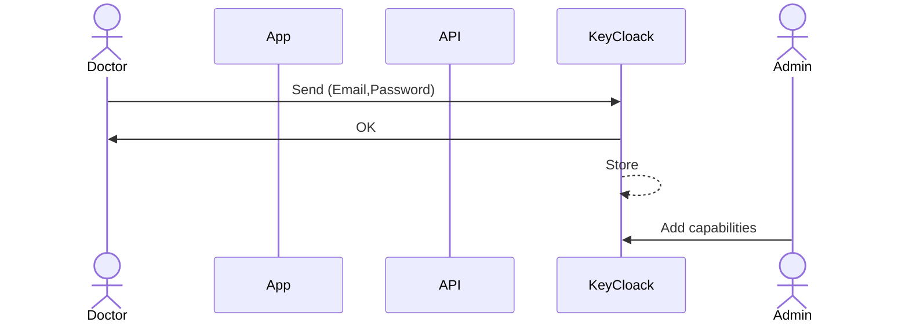
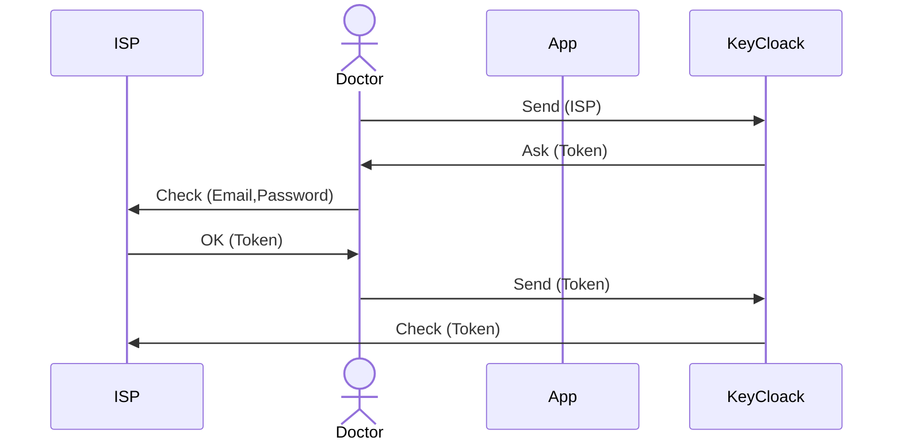
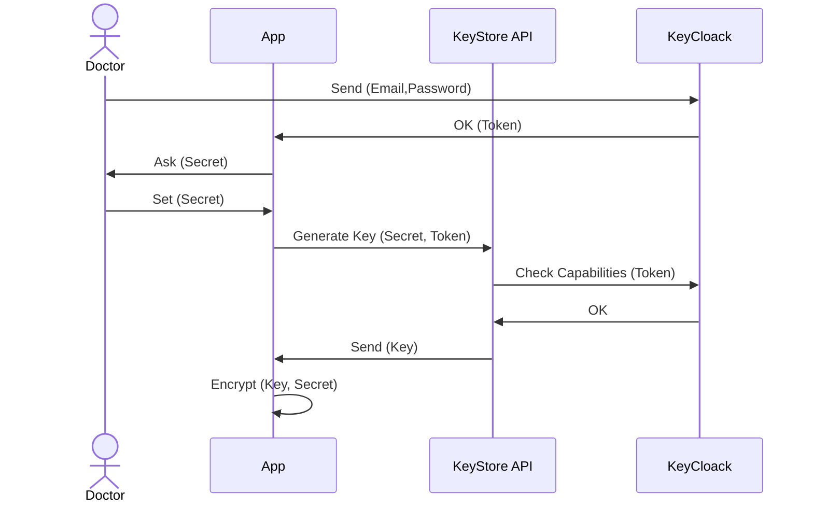
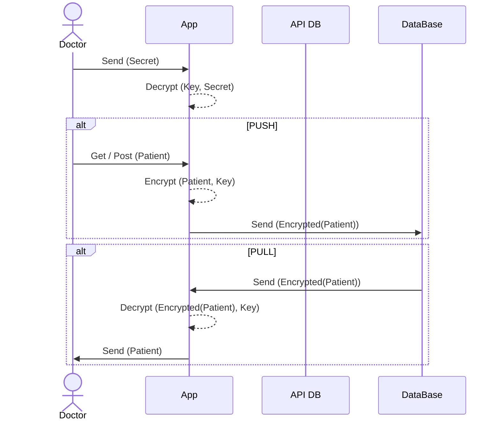

# 🎻 serenade

## UMLs

### Signup without ISP

### Signup with ISP



### Login
The KeyStore API must be a trusted microservice. It allows to:
1. Don't save `Key` on client app
2. Regenerate `Key` when needed (forgot `Secret`, reset client app)

`Key` will be used to encrypt data on client side. Key is encryped with `Secret`

### Pull and Push Data


## Logic Model

### V0
```
Patient(PID, I#)
Installation(I#)

PatientGeneral(I#, Surname, Address, PhoneNo)
PatientDetail(PID, Name, SSN, *DoB, *PoB, *Age)
SensitiveData(PID, ...)

Ticket(DateTime, I#, RefNo, Status, Notes)
```
### V1
```
Patient(PID)
Installation(I#)
Stream(I#, PID)

PatientGeneral(I#, Surname, Address, PhoneNo)
PatientDetail(PID, Name, SSN, *DoB, *PoB, *Age)
SensitiveData(PID, ...)

Ticket(DateTime, I#, RefNo, Status, Notes)
```
### V2
```
Patient(PID, DataNick)
Installation(I#, HouseNick)
Stream(SID, HouseNick, DataNick)

PatientGeneral(I#, Surname, Address, PhoneNo)
PatientDetail(PID, Name, SSN, *DoB, *PoB, *Age)
SensitiveData(SID, ...)

Ticket(DateTime, HouseNick, RefNo, Status, Notes)
```
**Advantages of this model:**
It's not neede to specify the capabilities for all lookup combinations, anyone who already has `Key` to decrypt lookup tables is authorized a priori to perform any lookup combination on the same table.

#### Lookup Tables
|              | Doctor | Monitor | Tech |
| ------------ | ------ | ------- | ---- |
| Patient      | ✅      | ❌       | ❌    |
| Installation | ✅      | ❌       | ✅    |
| Stream       | ✅      | ✅       | ❌    |

#### Other Tables
|                | Doctor | Monitor | Tech |
| -------------- | ------ | ------- | ---- |
| PatientGeneral | ✅      | ❌       | ✅    |
| PatientDetail  | ✅      | ❌       | ❌    |
| SensitiveData  | ⭕      | ✅       | ❌    |
| Ticket         | ✅      | ✅       | ✅    |

