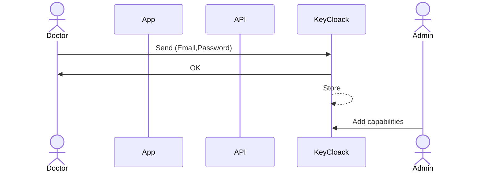
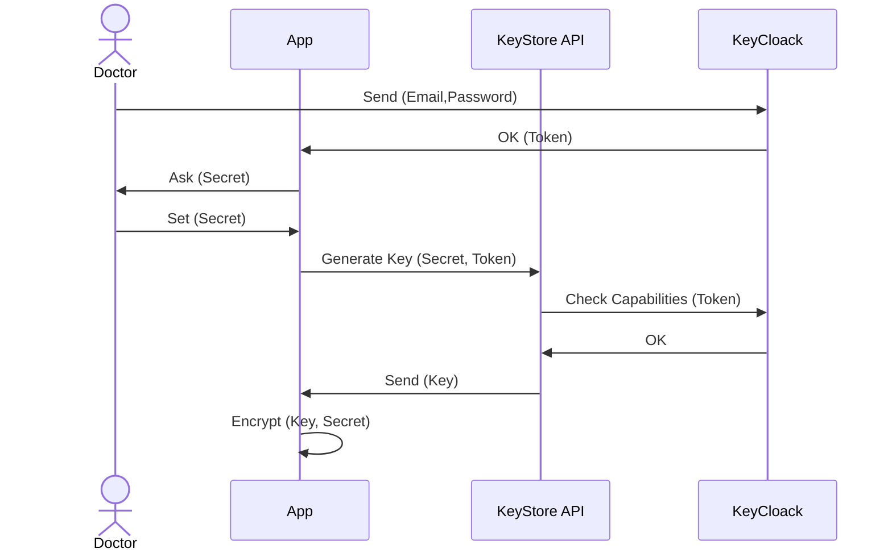
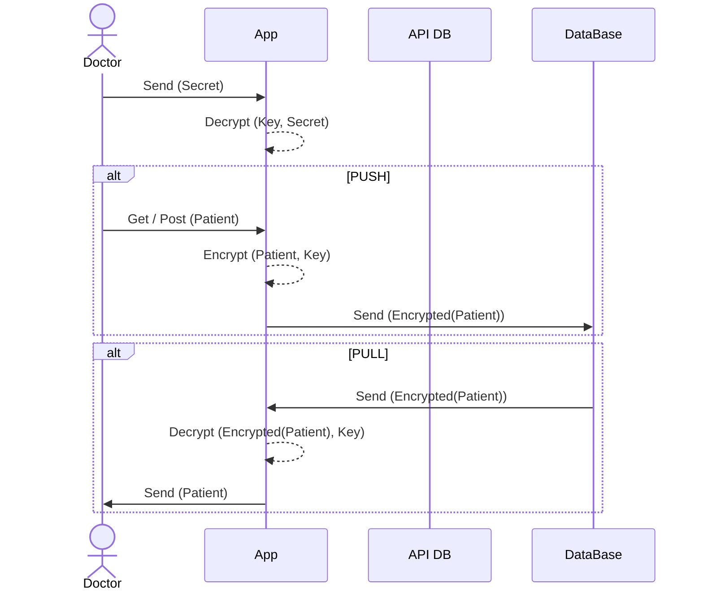

# 🎻 serenade

## Logic Model

### V0 - Fist model draft
```
Patient(PID, I#)
Installation(I#)

PatientGeneral(I#, Surname, Address, PhoneNo)
PatientDetail(PID, Name, SSN, *DoB, *PoB, *Age)
SensitiveData(PID, ...)

Ticket(DateTime, I#, RefNo, Status, Notes)
```
### V1 - Concept of `Stream` entity
```
Patient(PID)
Installation(I#)
Stream(I#, PID)

PatientGeneral(I#, Surname, Address, PhoneNo)
PatientDetail(PID, Name, SSN, *DoB, *PoB, *Age)
SensitiveData(PID, ...)

Ticket(DateTime, I#, RefNo, Status, Notes)
```
### V2 - Refactoring
```
Patient(PID, DataNick)
Installation(I#, HouseNick)
Stream(SID, HouseNick, DataNick)

PatientGeneral(I#, Surname, Address, PhoneNo)
PatientDetail(PID, Name, SSN, *DoB, *PoB, *Age)
SensitiveData(SID, ...)

Ticket(DateTime, HouseNick, RefNo, Status, Notes)
```
**Advantages of V2 model:**
It's not neede to specify the capabilities for all lookup combinations, anyone who already has `Key` to decrypt lookup tables is authorized a priori to perform any lookup combination on the same table.

#### Lookup Tables
|              | Doctor | Monitor | Tech |
| ------------ | ------ | ------- | ---- |
| Patient      | ✅      | ❌       | ❌    |
| Installation | ✅      | ❌       | ✅    |
| Stream       | ✅      | ✅       | ❌    |

#### Other Tables
|                | Doctor | Monitor | Tech |
| -------------- | ------ | ------- | ---- |
| PatientGeneral | ✅      | ❌       | ✅    |
| PatientDetail  | ✅      | ❌       | ❌    |
| SensitiveData  | ⭕      | ✅       | ❌    |
| Ticket         | ✅      | ✅       | ✅    |

## Authentication with KeyCloak

### Signup without IdP

### Signup with IdP


## Option A: Server side encypton
Some DB Framework (like PostgreSQL) supports fine-grained access control at the table level through the use of roles and permissions. You can assign specific privileges to those roles for particular tables. This allows you to control who perform certain actions on specific tables and log them.

1. **Roles** for different responsibilities in the application.

    ```sql
    CREATE ROLE dottore;
    CREATE ROLE tecnico;
    CREATE ROLE monitor;
    ```

2. **Grant Privileges**  to each role for the relevant tables.

    ```sql
    GRANT SELECT, INSERT, UPDATE, DELETE ON PatientDetail TO dottore;
    GRANT SELECT, INSERT ON Ticket TO tecnico;
    GRANT SELECT ON SensitiveData TO monitor;
    ```

3. **Assign Roles** to users:

    ```sql
    GRANT dottore TO dottore-alice;
    GRANT tecnico TO tecnico-bob;
    GRANT monitor TO monitor-charlie;
    ```

Then the dataset can be encypted using TDE (Transparent Data Encryption) on server side.

## Option B: Client side encryption

### Login
The KeyStore API must be a trusted microservice. It allows to:
1. Don't save `Key` on client app
2. Regenerate `Key` when needed (forgot `Secret`, reset client app)

`Key` will be used to encrypt data on client side. Key is encryped with `Secret`

### Pull and Push Data


