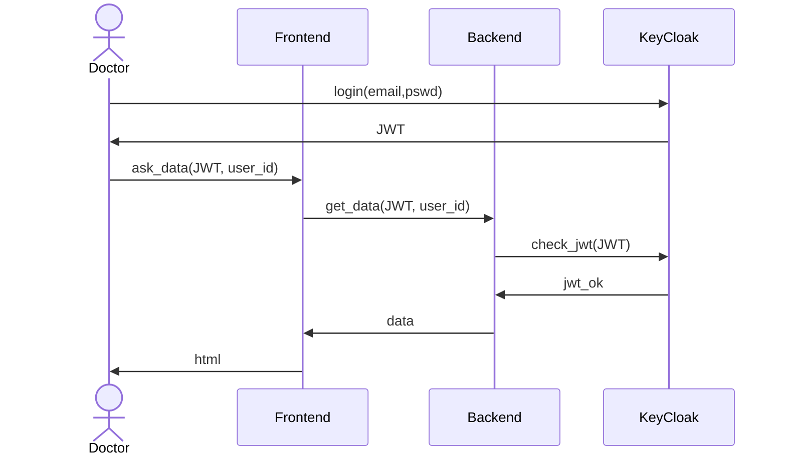

# Keycloak

Keycloak è una soluzione open-source per la gestione dell'identità e dell'accesso.
Le componenti e funzionalità principali nell'ambito di questo progetto sono:

- **Single Sign-On (SSO)**: Keycloak permette agli utenti di autenticarsi con più applicazioni utilizzando un unico set di credenziali.

- **Federazione degli Utenti**: Keycloak può connettersi a directory di utenti esistenti, come CAS, LDAP o Active Directory, per sfruttare le basi utenti esistenti senza richiedere la migrazione.

- **Console di Amministrazione**: Un'interfaccia web per gli amministratori per configurare i realms, i client, i ruoli e gestire gli utenti.

- **Protocolli Adattabili**: Keycloak supporta protocolli di autenticazione standard come OAuth 2.0, OpenID Connect e SAML 2.0, rendendolo compatibile con una vasta gamma di applicazioni e servizi.

- **Servizi di Autorizzazione**: Keycloak include capacità di autorizzazione dettagliate per controllare l'accesso alle applicazioni e ai servizi basati su ruoli e permessi degli utenti.

- **Self-Service per gli Utenti**: Gli utenti possono gestire i propri account, aggiornare i profili e reimpostare le password tramite un'interfaccia di gestione account facile da usare.

- **Registrazione degli Eventi e Audit**: Keycloak registra eventi di autenticazione e autorizzazione, che possono essere utilizzati per il monitoraggio, l'audit e la conformità alla sicurezza.

## Autenticazione

La piattaforma integra `OpenID Connect` come meccanismo di autenticazione.

Per ogni ogni richiesta al backend è richiesto un token JWT.
Questo token viene assegnato all'inizio della sessione da Keycloak.
Il backend controlla se il token è attivo, e se il ruolo dell'utente a cui è associato il token ha accesso alle informazioni richieste.



## Utilizzo

### Utenti

Gli utenti possono gestire il loro account accedendo con le loro credenziali al portale del realm, ad esempio su [`http://keycloak/realms/serenade/account`](http://keycloak/realms/serenade/account).
Da qui possono cambaire la password e integrare informazioni facoltative.

### Admin

1. Accedere al servizio web (a.e [`http://keycloak/`](http://keycloak/))
2. Inserire le credenziali master (impostate attraverso `.envars/.env.keykloak`)
3. Selezionare il realm `serenade` dalla tendina in alto a sinistra

Verranno presentate più schede, quelle rilevanti sono `Users` e `Realm roles` per la gestione rispettivamente degli utenti e dei ruoli ad essi collegati:

- Una volta selezionato il realm `serenade` nella tab `Manage/Users` si possono aggiungere nuovi utenti premendo `Add users`.
- Una volta creato un nuovo utente e selezionato l'utente nella tab `Role Mapping` si può assegnare un nuovo ruolo premendo `Add role`.

I ruoli utilizzati per i meccanismi di autorizzazione sono:

- `imt`
- `iit`
- `dottore`
- `unimi`

## Configurazioni

Il file `.keycloak_realms/serenade.json` riporta l'ultimo snapshot del realm del progetto `serenade`

È possibilre esportare tutte le configurazioni correnti del realm del progetto (`serenade`) utilizzando lo script `.utils/export.realm.sh`.
Verrà chiesto in input il nome del container del servizio keycloak.
Lo snapshot del realm verrà salvato nel file `serenade.json`, e sovarscriverà lo snapshot importato in precedenza.
Questo comportamento è automatizzato tramite il binding di volume impostato nel `docker-compose.yml`:

```yaml
keycloak:
    volumes:
        - ./.keycloak_realms:/opt/keycloak/data/import
```

È possibile importare il realm al primo avvio sempre utilizzando il binding di volume, opppure attraverso la web app utilizzado il bottone `Create realm` nella tendina in alto a sinistra.
