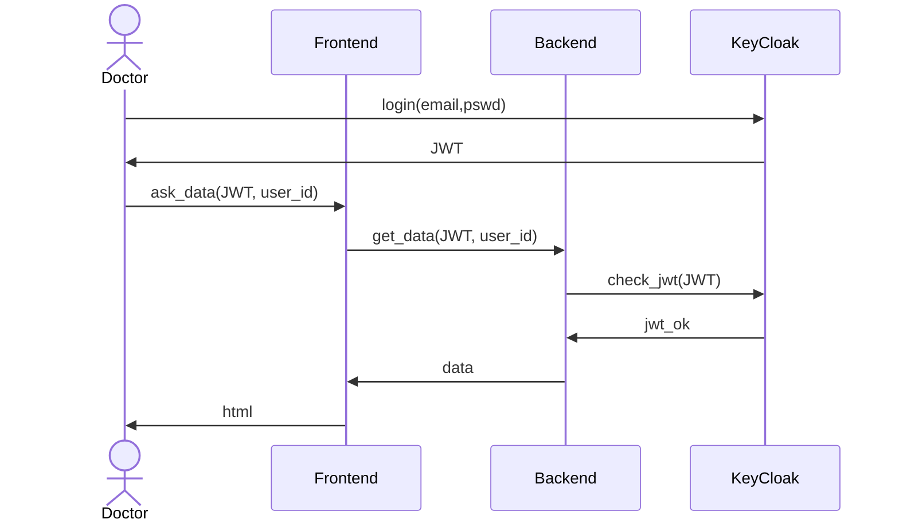

# Keycloak

Per informazioni aggiuntive si rimanda alla documentazione di Keycloak.

## Autenticazione

La piattaforma utilizza `OpenID-connect` come meccanismo di autorizzazione. 

Ad ogni richiesta al backend e' associato un token JWT che viene assegnato alla sessione da Keycloak. Il backend prima di rispondere controlla se il token JWT e' attivo e se il ruolo dell'utente a cui e' associato il token ha accesso alle informazioni richieste. 

## Configurazioni

Nel file `.envars/.env.keycloak` sono impostate le credenziali amministrative per la piattaforma keycloak.

Nel file `.keycloak_realms/serenade.json` e' riportato un json di snapshot dell'intera instanza Keycloak e dei suoi realms, il realm di riferimento si chiama `serenade`, per modificarlo va impostato nel dropdown della home nella console admin Keycloak che si apre dopo il login. 

A seguito di una modifica su Keycloak con lo script `.utils/export.realm.sh` dando in input il nome del container di Keycloak si puo' salvare un nuovo `json` snapshot.

## Utenti

Una volta selezionato il realm `serenade` nella tab `Manage/Users` si possono aggiungere nuovi utenti premendo `Add users`.

Una volta creato un nuovo utente e selezionato l'utente nella tab `Role Mapping` si puo' assegnare un nuovo ruolo premendo `Add role`. 

I ruoli utilizzati per i meccanismi di autorizzazione sono:

- `imt`
- `iit`
- `dottore`
- `unimi` 
